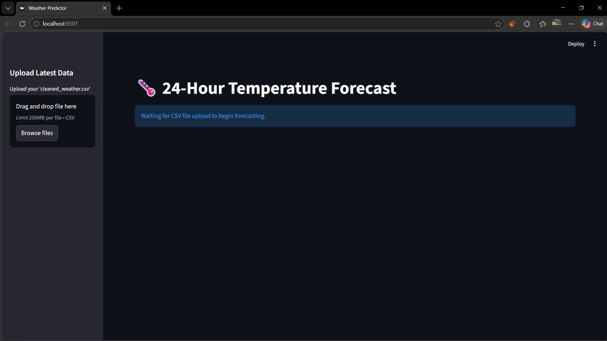
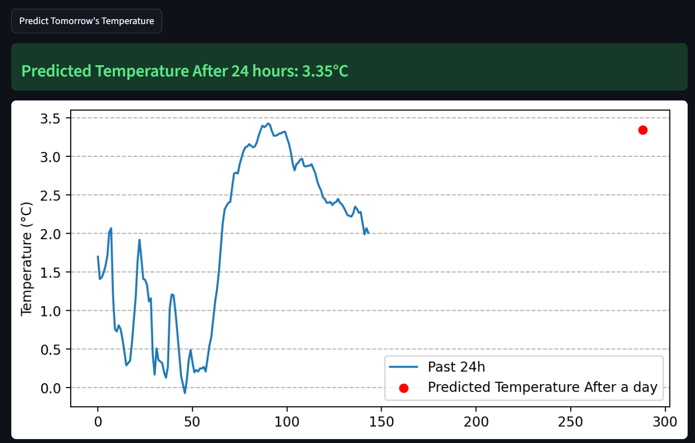

# 🌡️ Time-Series Weather Temperature Forecasting using LSTM

[](https://www.python.org/)
[](https://www.tensorflow.org/)
[](https://streamlit.io/)
[](https://opensource.org/licenses/MIT)

An end-to-end machine learning project that predicts the outdoor temperature 24 hours into the future using a Long Short-Term Memory (LSTM) neural network. The project features a complete preprocessing, training, and evaluation pipeline, along with an interactive Streamlit web dashboard for real-time inference, data visualization, and model validation.

---

## 📖 Project Description

Accurate temperature forecasting is critical for energy grid management, agricultural planning, and logistics. This project treats temperature forecasting as a **multivariate regression problem**, leveraging historical values of temperature, humidity, pressure, wind speed, and solar radiation to forecast future weather states. 

Using a sliding window of the last 24 hours (144 timesteps at 10-minute intervals), the trained LSTM model captures temporal dependencies and non-linear patterns to output a precise temperature prediction for the next 24 hours.

---

## 📊 Dataset

The model is trained on a high-resolution multivariate weather dataset collected from a meteorological station.

* **Observations:** ~52,560 records
* **Frequency:** Recorded every 10 minutes (covering a full year of weather data)
* **Type:** Multivariate Time-Series

### Features Used

<details>
<summary><b>Click to expand feature details</b></summary>

| Feature | Code Name | Description |
| :--- | :--- | :--- |
| **Temperature** | `T` | Ambient outdoor temperature in degrees Celsius (°C) |
| **Relative Humidity** | `rh` | Percentage of moisture in the air relative to saturation (%) |
| **Pressure** | `p` | Atmospheric pressure in hectopascals (hPa) |
| **Wind Speed** | `wv` | Velocity of wind in meters per second (m/s) |
| **Solar Radiation** | `SWDR` | Shortwave Downward Radiation (W/m²) |

</details>

---

## ⚙️ Machine Learning Pipeline

The following flow chart illustrates the end-to-end data engineering and model training workflow:

```text
Weather Dataset
       │
       ▼
 Data Cleaning (Forward/Backward Fill)
       │
       ▼
 Feature Selection (T, rh, p, wv, SWDR)
       │
       ▼
 Missing Value Handling
       │
       ▼
 MinMax Scaling (Features & Targets Scaled Separately)
       │
       ▼
 Sliding Window Creation (144 timesteps = Last 24 Hours)
       │
       ▼
 LSTM Model Training (TensorFlow/Keras Sequential Model)
       │
       ▼
 Model Evaluation (R², MAE, RMSE Metrics)
       │
       ▼
 Save Model & Scalers (weather_model.keras, scaler_x.pkl, scaler_y.pkl)
       │
       ▼
 Streamlit Deployment (Interactive Web Application)
       │
       ▼
 Temperature Prediction (Real-time Inference)
```

---

## 🧠 Model Architecture & Configuration

The model is built using **TensorFlow & Keras**, optimized specifically for sequence processing and temporal memory retention.

* **Model Class:** `tf.keras.models.Sequential`
* **Architecture:**
  * **Input Layer:** Shape `(144, 5)` representing 144 historical timesteps and 5 input features.
  * **LSTM Layer 1:** 64 hidden units (returns sequences).
  * **Dropout Layer:** 20% regularization rate to prevent overfitting.
  * **LSTM Layer 2:** 32 hidden units.
  * **Dropout Layer:** 20% regularization rate.
  * **Dense Output Layer:** 1 node predicting the future temperature value.
* **Loss Function:** Mean Squared Error (MSE)
* **Optimizer:** Adam Optimizer
* **Training Settings:** Mini-batch training with validation monitoring.

---

## 📈 Evaluation Metrics

The model is evaluated using standard regression metrics. Since this is a regression task rather than a classification problem, metrics such as accuracy and confusion matrices are not applicable.

| Metric | Value | Interpretation |
| :--- | :--- | :--- |
| **R² Score** | **0.6251** | Evaluates the proportion of variance explained by the model |
| **MAE** (Mean Absolute Error) | **2.3877°C** | Average magnitude of prediction errors |
| **RMSE** (Root Mean Squared Error) | **3.4187°C** | Penalizes larger forecasting errors |

---

## 🖥️ Streamlit Application

The deployment application provides an intuitive web interface for non-technical users to utilize the model.

1. **Data Upload:** Users upload a CSV file containing the latest 24 hours of weather observations.
2. **Automated Pipeline:** Preprocessing, sequence window extraction, and normalization scaling are run automatically in the background.
3. **Inference Engine:** Runs the input sequence through the saved LSTM model.
4. **Predictive Output:** Displays the exact predicted temperature 24 hours from the last data point.
5. **Interactive Visualization:** Plots the previous 24-hour temperature trend alongside the future predicted forecast point for visual validation.

---

## 📷 Application Screenshots

### Dashboard


*Figure 1: Streamlit Dashboard allowing users to upload a CSV file with the latest weather observations.*

---

### Prediction Result


*Figure 2: Forecast result showing the predicted temperature alongside the historical trend plot.*

---

## 📂 Project Structure

```text
Weather-Temperature-Forecasting/
│
├── app.py                  # Streamlit web application dashboard
├── train.py                # Model training and validation script
├── preprocess.py           # Data loading, cleaning, and sequence scaling utilities
├── predict.py              # Standalone command-line inference script
├── requirements.txt        # Python library dependencies
├── weather_model.keras     # Trained TensorFlow/Keras model file
├── scaler_x.pkl            # MinMaxScaler fitted on feature set
├── scaler_y.pkl            # MinMaxScaler fitted on target (Temperature)
├── data/                   # Directory containing weather datasets
│   └── cleaned_weather.csv
├── images/                 # App interface screenshots for documentation
│   ├── dashboard.png
│   └── prediction.png
├── notebooks/              # Jupyter notebooks for exploratory data analysis
│   └── main.ipynb
├── README.md               # Repository documentation
└── LICENSE                 # Project license
```

---

## 🚀 Installation & Getting Started

### Prerequisites

* Python 3.8 or higher
* Pip package manager

### Steps

1. **Clone the Repository:**
   ```bash
   git clone <repository-url>
   cd Weather-Temperature-Forecasting
   ```

2. **Install Dependencies:**
   ```bash
   pip install -r requirements.txt
   ```

3. **Run the Streamlit Dashboard:**
   ```bash
   streamlit run app.py
   ```

4. **Run CLI Inference:**
   ```bash
   python predict.py
   ```

---

## 🛠️ Technologies Used

* **Language:** Python
* **Deep Learning:** TensorFlow, Keras
* **Web Hosting & UI:** Streamlit
* **Data Science & Manipulation:** Pandas, NumPy, Scikit-learn
* **Data Visualization:** Matplotlib

---

## 🎯 Key Achievements

* **End-to-End Pipeline:** Developed a production-grade time-series forecasting pipeline spanning data cleaning, window generation, training, and web deployment.
* **Large-Scale Data Processing:** Successfully cleaned and engineered over 52,000 weather observations recorded at 10-minute intervals.
* **Feature Engineering:** Implemented a rolling sliding-window generator of 144 timesteps to capture a 24-hour historical temporal context.
* **Automated Normalization:** Preserved and loaded independent feature (`scaler_x.pkl`) and target (`scaler_y.pkl`) scalers to prevent data leakage during real-time inference.
* **Interactive Inference:** Designed and deployed an interactive Streamlit UI showing predictions and visual forecast trajectories.
* **Robust Evaluation:** Verified the model performance on test data using R², MAE, and RMSE metrics.

---

## 🔮 Future Improvements

* **Hyperparameter Tuning:** Implement KerasTuner to optimize hidden unit sizes, learning rates, and dropout rates.
* **Architecture Comparison:** Implement and compare performance with Gated Recurrent Units (GRU) and temporal Transformer architectures.
* **Multi-Step Forecasting:** Expand target outputs from single-point predictions to a continuous 24-hour ahead forecast sequence.
* **Real-time API Integration:** Integrate open-source weather APIs (e.g., OpenWeatherMap) to fetch real-time observations and automate continuously updating forecasts.
* **Containerization:** Package the application using Docker for OS-agnostic deployment.
* **Cloud Deployment:** Deploy the dashboard container to AWS ECS / GCP Cloud Run.
* **Explainable AI (XAI):** Integrate SHAP (SHapley Additive exPlanations) to explain feature importance and temporal contributions to temperature fluctuations.

---


## 👤 Author

* **Name:** [Shubham Patidar]
* **GitHub:** [shubhamptdr001](https://github.com/shubhamptdr001)
* **LinkedIn:** [shubham-patidar](https://www.linkedin.com/in/shubham-patidar-479417229/)
* **Email:** [shubham-patidar](mailto:shubhamptdr619@gmail.com)
